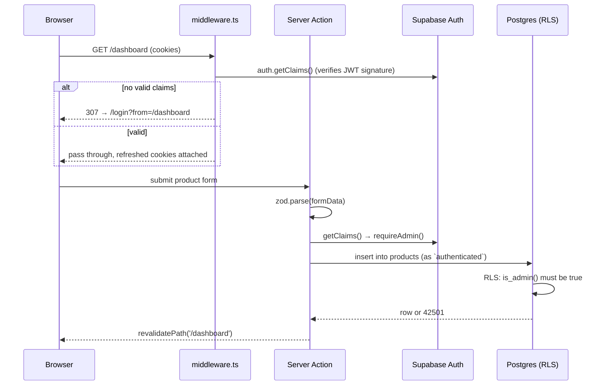
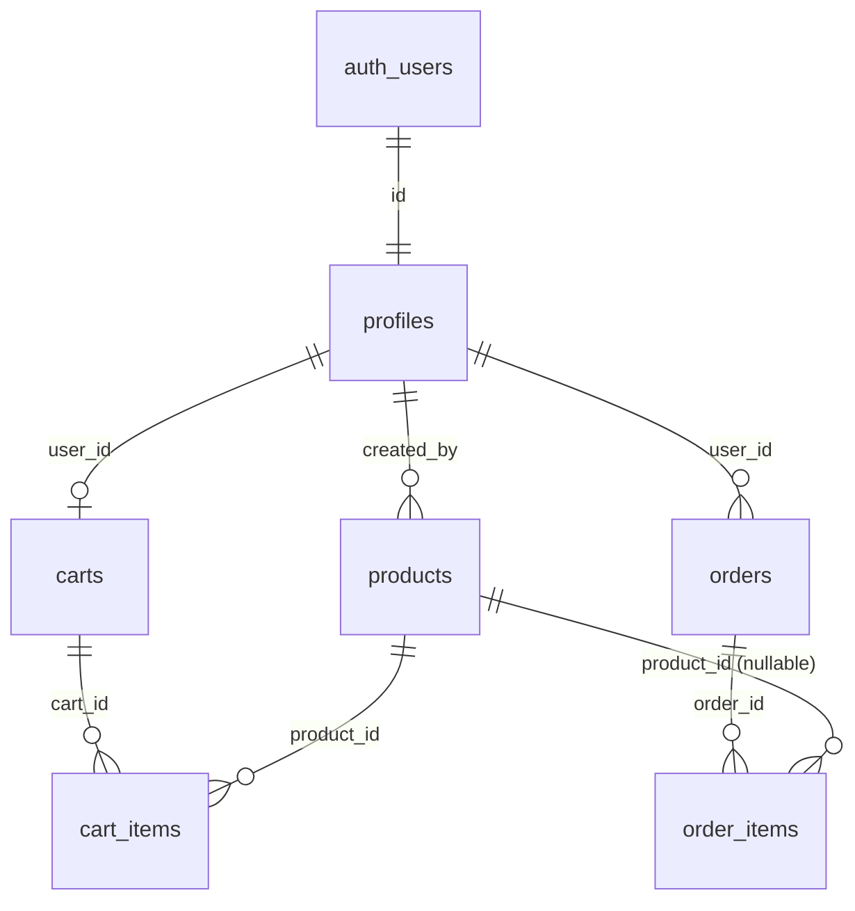

# Implementation Plan — Supabase Backend (Auth · Products · Cart · Orders)

> Replaces the mock backend (`mockAuthBackend.ts`, localStorage catalog, fake
> order references, hand-rolled HMAC session cookie) with a real Supabase
> Postgres backend: **Supabase Auth**, **RLS-enforced CRUD**, **Storage** for
> product images, and a **transactional checkout**.
>
> **Baseline:** build, typecheck, lint, 64 unit/component tests, and 20 e2e tests
> are green on `main` @ `1e6bb32`. This plan intentionally breaks several of them —
> see [§10 Test Impact](#10-test-impact).
>
> **Status:** planning only. No code written yet.

---

## Table of Contents

1. [Decisions Taken](#1-decisions-taken)
2. [Goals & Non-Goals](#2-goals--non-goals)
3. [Target Architecture](#3-target-architecture)
4. [Data Model](#4-data-model)
5. [Security Model](#5-security-model)
6. [Migrations](#6-migrations)
7. [Application Layer — Repository Pattern](#7-application-layer--repository-pattern)
8. [File Change Map](#8-file-change-map)
9. [Phased Implementation](#9-phased-implementation)
10. [Test Impact](#10-test-impact)
11. [Environment & Secrets](#11-environment--secrets)
12. [Risks & Rollback](#12-risks--rollback)
13. [Definition of Done](#13-definition-of-done)
14. [Open Questions](#14-open-questions)

---

## 1. Decisions Taken

| #   | Decision | Choice | Rationale |
| --- | -------- | ------ | --------- |
| D1  | Data access pattern | **Server-first.** RSC reads, Server Actions write, via `@supabase/ssr` with the *publishable* key + user session. | Postgres RLS is the enforcement layer; no secret ever reaches the browser; idiomatic for Next 15 App Router. |
| D2  | Mock mode | **Dual-mode.** Supabase when configured, existing mocks when not. | Keeps the `npm install && npm run dev` zero-backend promise that makes this a boilerplate. |
| D3  | Scope | Auth + profiles + roles · Products CRUD + image storage · Server-persisted cart · Orders + checkout. | Full vertical slice; every layer gets exercised. |
| D4  | Project target | **New Supabase project, migrations-first.** All schema in `supabase/migrations/*.sql`, applied by CLI. | Reviewable, replayable, no click-ops. Local `supabase start` for daily dev. |
| D5  | Branch selection | A thin **repository interface per feature** with two implementations, selected once in a factory. | Replaces the 5 scattered `if (isMockMode)` branches in `productService.ts`. One seam, not many. |
| D6  | Money | `integer` **cents** in the DB; dollars only at the formatting edge. | Floats and money don't mix. |
| D7  | Product identity | `uuid` primary key + unique `slug`; routes move to `/products/[slug]`. | Stable ids, readable URLs, no id guessing. |
| D8  | Order integrity | A single `SECURITY DEFINER` RPC that reads the cart **server-side**, locks product rows, and computes totals from the DB. | The client sends *no prices and no line items* — price tampering is structurally impossible. |
| D9  | Session validation | `supabase.auth.getClaims()` everywhere server-side. Never `getSession()`. | `getClaims()` verifies the JWT signature against the project's published keys; `getSession()` does not revalidate and is spoofable from cookies. |
| D10 | Validation | **Zod** at every server boundary (Server Actions, route handlers, env). | Currently no schema validation exists anywhere. Server Actions are public HTTP endpoints. |

---

## 2. Goals & Non-Goals

### Goals

- Real, durable persistence for products, carts, and orders.
- Real authentication with email + password, email confirmation, and password reset.
- Authorization enforced **in the database**, not just in React.
- A migration history that any clone can replay from zero.
- Automated proof that the RLS policies actually hold (pgTAP).
- The boilerplate still boots with no Supabase project configured.

### Non-Goals (explicitly out of scope for this plan)

- Payments. Checkout stays a demo; `orders.status` never leaves `pending`.
- Realtime subscriptions.
- OAuth / social providers (the schema won't block adding them later).
- Multi-tenancy, teams, or organizations.
- Admin user management UI (roles are set via SQL for now).
- Server-side search beyond `ilike` + trigram (no full-text ranking, no pgvector).

---

## 3. Target Architecture

### 3.1 Layers

```
┌─────────────────────────────────────────────────────────────────┐
│ Client Components                                               │
│  cart drawer · product form · filters                           │
│  → useQuery/useMutation → Server Actions (never Supabase)       │
└────────────────────────────┬────────────────────────────────────┘
                             │
┌────────────────────────────▼────────────────────────────────────┐
│ Server Components / Server Actions / Route Handlers             │
│  · zod-validate input                                           │
│  · getClaims() → authenticate + authorize                       │
│  · call repository                                              │
│  · revalidatePath / return typed result                         │
└────────────────────────────┬────────────────────────────────────┘
                             │
┌────────────────────────────▼────────────────────────────────────┐
│ Repository layer   src/features/*/repositories/                 │
│  ProductRepository │ CartRepository │ OrderRepository           │
│    ├── supabase implementation   (Postgres)                     │
│    └── mock implementation       (in-memory / localStorage)     │
└────────────────────────────┬────────────────────────────────────┘
                             │
┌────────────────────────────▼────────────────────────────────────┐
│ Supabase clients   src/lib/supabase/                            │
│  server.ts (RSC/actions) │ client.ts (browser) │ middleware.ts  │
│  admin.ts  ← service-role, `import "server-only"`, admin tasks  │
└────────────────────────────┬────────────────────────────────────┘
                             │
┌────────────────────────────▼────────────────────────────────────┐
│ Postgres + RLS + SECURITY DEFINER RPCs + Storage                │
│  ← the actual security boundary                                 │
└─────────────────────────────────────────────────────────────────┘
```

### 3.2 Rules that make this safe

1. **The browser never holds a Supabase client that can write.** `client.ts`
   exists only for `onAuthStateChange` and sign-out; all mutations go through
   Server Actions.
2. **Every Server Action re-authorizes.** Server Actions are publicly callable
   HTTP endpoints — a hidden button is not authorization. Each one starts with
   `requireUser()` or `requireAdmin()`.
3. **Middleware is a redirect, not a guard.** It refreshes the token and bounces
   anonymous users off `/dashboard`. The real guards are the layout's server-side
   `getClaims()` check *and* RLS underneath it.
4. **`admin.ts` is quarantined.** Service-role client is `import "server-only"`,
   never used in a request path that renders user data, and lint-guarded.

### 3.3 Auth request flow



---

## 4. Data Model



### 4.1 Enums

| Enum | Values | Maps to |
| ---- | ------ | ------- |
| `app_role` | `admin` · `member` · `viewer` | existing `UserRole` in `src/features/auth/types` |
| `product_category` | `template` · `plugin` · `asset` · `service` | existing `ProductCategory` |
| `order_status` | `pending` · `paid` · `cancelled` | new |

### 4.2 Tables

**`public.profiles`** — one row per `auth.users`, created by trigger.

| Column | Type | Notes |
| ------ | ---- | ----- |
| `id` | `uuid` PK | `references auth.users(id) on delete cascade` |
| `name` | `text not null` | from sign-up metadata |
| `avatar_url` | `text` | nullable |
| `role` | `app_role not null default 'member'` | **not user-writable** — see §5.3 |
| `created_at` / `updated_at` | `timestamptz` | `updated_at` via trigger |

**`public.products`**

| Column | Type | Notes |
| ------ | ---- | ----- |
| `id` | `uuid` PK `default gen_random_uuid()` | |
| `slug` | `text not null unique` | URL key; `citext`-style lowercase check |
| `name` | `text not null` | `check (length(name) between 1 and 120)` |
| `summary` | `text not null` | `check (length(summary) <= 200)` |
| `description` | `text not null` | |
| `price_cents` | `integer not null` | `check (price_cents >= 0)` |
| `category` | `product_category not null` | |
| `image_path` | `text` | Storage object path, **not** a full URL |
| `rating` | `numeric(2,1) not null default 0` | `check (rating between 0 and 5)` |
| `stock` | `integer not null default 0` | `check (stock >= 0)` |
| `is_published` | `boolean not null default true` | drafts invisible to the public |
| `created_by` | `uuid` | `references profiles(id) on delete set null` |
| `created_at` / `updated_at` | `timestamptz` | |

**`public.carts`** — `id uuid PK`, `user_id uuid not null unique references auth.users on delete cascade`, timestamps.

**`public.cart_items`** — `id uuid PK`, `cart_id` → `carts on delete cascade`, `product_id` → `products on delete cascade`, `qty integer not null check (qty between 1 and 99)`, `unique (cart_id, product_id)`.

**`public.orders`**

| Column | Type | Notes |
| ------ | ---- | ----- |
| `id` | `uuid` PK | |
| `user_id` | `uuid not null` | `references auth.users on delete cascade` |
| `reference` | `text not null unique` | human-readable, e.g. `STU-7F3K29` |
| `email` | `text not null` | `check` against an email regex |
| `status` | `order_status not null default 'pending'` | |
| `subtotal_cents` / `total_cents` | `integer not null` | computed server-side only |
| `created_at` | `timestamptz` | |

**`public.order_items`** — `id`, `order_id` → `orders on delete cascade`, `product_id` → `products **on delete set null**`, plus **snapshot columns** `name`, `slug`, `unit_price_cents`, `qty`. An order must still render correctly after the product is deleted or repriced — that's the whole point of the snapshot.

### 4.3 Indexes

Every column referenced in an RLS policy or a hot filter gets one — unindexed
policy columns are the #1 cause of RLS performance collapse:

```sql
create index on public.carts (user_id);
create index on public.cart_items (cart_id);
create index on public.cart_items (product_id);
create index on public.orders (user_id, created_at desc);
create index on public.order_items (order_id);
create index on public.products (category) where is_published;
create index on public.products using gin (name gin_trgm_ops);  -- search
```

---

## 5. Security Model

> This section is the reason the plan exists. Treat it as the acceptance
> criteria for "security is good".

### 5.1 Non-negotiables

- [ ] RLS **enabled** on all six public tables. No exceptions, no "we'll add it later".
- [ ] Policies are **deny-by-default**: no policy = no access.
- [ ] Every policy names its role (`to authenticated` / `to anon`) — an
      unqualified policy is evaluated for every role, including `anon`.
- [ ] Every `auth.uid()` / helper call is wrapped as `(select …)` so Postgres
      caches it as an InitPlan instead of re-evaluating per row
      (Supabase lint `0003_auth_rls_initplan`).
- [ ] Every `SECURITY DEFINER` function sets `search_path = ''` and
      fully-qualifies every identifier (lint `function_search_path_mutable`).
      Without this, a `SECURITY DEFINER` function is a privilege-escalation
      primitive.
- [ ] `supabase.auth.getClaims()` for all server-side authorization.
      `getSession()` is banned in server code — add an ESLint `no-restricted-syntax` rule.
- [ ] The service-role key appears in exactly one file (`src/lib/supabase/admin.ts`),
      which starts with `import "server-only"`.
- [ ] `npx supabase db lint` and the `get_advisors` security check run clean.

### 5.2 Policy matrix

| Table | `anon` | `authenticated` (self) | `admin` |
| ----- | ------ | ---------------------- | ------- |
| `profiles` | — | `select` own · `update` own (name/avatar only) | `select` all |
| `products` | `select` where `is_published` | `select` where `is_published` | full CRUD |
| `carts` | — | full CRUD where `user_id = uid` | — |
| `cart_items` | — | full CRUD where parent cart is theirs | — |
| `orders` | — | `select` own · **insert only via RPC** | `select` all |
| `order_items` | — | `select` where parent order is theirs | `select` all |

Note what's *absent*: no `update` or `delete` policy on `orders` or
`order_items` for anyone. An order is immutable once written.

Representative policy shape:

```sql
alter table public.cart_items enable row level security;

create policy "cart_items_all_own"
  on public.cart_items
  for all
  to authenticated
  using (
    cart_id in (select id from public.carts where user_id = (select auth.uid()))
  )
  with check (
    cart_id in (select id from public.carts where user_id = (select auth.uid()))
  );
```

### 5.3 Role storage and privilege escalation

`profiles.role` drives admin access, so a user updating their own row must not
be able to touch it. Column-level privileges make that airtight:

```sql
revoke update on public.profiles from authenticated;
grant  update (name, avatar_url) on public.profiles to authenticated;
```

Role checks in policies go through a cached helper rather than an inline join:

```sql
create function public.is_admin()
returns boolean
language sql
stable
security definer
set search_path = ''
as $$
  select exists (
    select 1 from public.profiles
    where id = (select auth.uid()) and role = 'admin'
  );
$$;
```

…used as `using ((select public.is_admin()))`.

> **Documented v2 optimization:** move `app_role` into the JWT via a
> `custom_access_token_hook`, so policies read `(select auth.jwt() ->> 'app_role')`
> with zero table lookups. Trade-off: a role change doesn't take effect until the
> token refreshes (≤1h). Not in v1 — noted so the upgrade path is obvious.

### 5.4 Checkout integrity

`public.place_order(p_email text)` — `SECURITY DEFINER`, `search_path = ''`:

1. `v_user := auth.uid()`; abort if null.
2. Read the caller's `cart_items` **from the database**. The client passes no
   line items and no prices.
3. `select … from public.products where id = any(…) for update` — row locks
   prevent two concurrent checkouts overselling the same unit.
4. Reject if any product is unpublished, missing, or `stock < qty`.
5. Compute `subtotal_cents` / `total_cents` from `products.price_cents`.
6. Insert `orders` + `order_items` (with name/price snapshots), decrement
   `products.stock`, delete the cart items — one transaction, all or nothing.
7. Return the order id + reference.

`grant execute on function public.place_order to authenticated;` and nothing else.

### 5.5 Storage

Bucket `product-images`, public read, admin-only write:

```sql
create policy "product_images_admin_write"
  on storage.objects for insert to authenticated
  with check (bucket_id = 'product-images' and (select public.is_admin()));
```

Plus, at the app boundary: allow-list `image/png|jpeg|webp|avif`, cap at 2 MB,
generate the object path server-side (`products/{uuid}.{ext}`) — never from the
user-supplied filename, which is a path-traversal vector. `products.image_path`
stores the path; the public URL is derived at render time.

### 5.6 Transport & headers

`next.config.ts` currently sets four headers but **no CSP**. Add one, and extend
image remote patterns:

```
Content-Security-Policy:
  default-src 'self';
  script-src 'self' 'nonce-{RANDOM}';
  style-src 'self' 'unsafe-inline';
  img-src 'self' data: https://<ref>.supabase.co;
  connect-src 'self' https://<ref>.supabase.co wss://<ref>.supabase.co;
  frame-ancestors 'none'; object-src 'none'; base-uri 'self';
Strict-Transport-Security: max-age=31536000; includeSubDomains; preload
```

Also add `{ protocol: "https", hostname: "<ref>.supabase.co" }` to
`images.remotePatterns`, and drop `picsum.photos` once seeds use Storage.

### 5.7 Threat checklist

| Threat | Mitigation |
| ------ | ---------- |
| Forged session cookie | `getClaims()` verifies the JWT signature; `getSession()` banned server-side |
| Direct PostgREST call bypassing the UI | RLS — the API and the UI enforce the same rules |
| Privilege escalation via profile update | Column-level `grant update (name, avatar_url)` |
| Price tampering at checkout | Server reads cart + prices from DB; client sends only an email |
| Oversell race | `select … for update` inside the RPC transaction |
| Service-role key leaking to the browser | Single quarantined module + `server-only` + lint rule + `.env.local` gitignored |
| Unauthorized Server Action invocation | `requireUser()` / `requireAdmin()` as the first statement in every action |
| Path traversal via upload filename | Server-generated object paths, extension allow-list |
| Stored XSS via product description | React escapes by default; no `dangerouslySetInnerHTML` anywhere; enforce via lint |
| Credential stuffing | Supabase Auth built-in rate limits + strong password policy (min 10 chars, HIBP check enabled in dashboard) |
| Email enumeration on sign-up | Return a generic "check your email" response for both new and existing addresses |

---

## 6. Migrations

`supabase/migrations/` — forward-only, one concern per file, every one runnable
on an empty database.

| File | Contents |
| ---- | -------- |
| `0001_extensions_enums.sql` | `pg_trgm`; the three enums; shared `set_updated_at()` trigger fn |
| `0002_profiles.sql` | `profiles` + RLS + column grants + `handle_new_user()` trigger on `auth.users` + `is_admin()` |
| `0003_products.sql` | `products` + constraints + indexes + RLS + `updated_at` trigger |
| `0004_storage.sql` | `product-images` bucket + `storage.objects` policies |
| `0005_carts.sql` | `carts`, `cart_items` + RLS + `merge_guest_cart(jsonb)` RPC |
| `0006_orders.sql` | `orders`, `order_items` + RLS + `place_order(text)` RPC |
| `supabase/seed.sql` | 6 products ported from `mockProducts.ts` + a demo admin and member |

`supabase/tests/` — pgTAP specs run by `supabase test db`:

| File | Asserts |
| ---- | ------- |
| `rls_products.test.sql` | anon reads published only; member cannot insert; admin can; unpublished hidden from anon |
| `rls_carts.test.sql` | user A cannot read/write user B's cart or items |
| `rls_orders.test.sql` | user A cannot read B's orders; nobody can `update`/`delete` an order |
| `rls_profiles.test.sql` | a member's attempt to set `role = 'admin'` on their own row is rejected |
| `rpc_place_order.test.sql` | insufficient stock aborts; stock decrements; cart clears; totals match DB prices |

> These five files are the executable version of §5. A policy without a pgTAP
> test is an assumption, not a control.

---

## 7. Application Layer — Repository Pattern

`productService.ts` currently branches on `isMockMode` in all five methods.
Adding three more entities that way means ~20 branches. Instead — one interface,
two implementations, one selection point:

```
src/features/product/
  repositories/
    productRepository.ts          # interface + factory (the only branch)
    supabaseProductRepository.ts
    mockProductRepository.ts      # today's localStorage logic, moved verbatim
  actions/
    productActions.ts             # "use server" — validate, authorize, delegate
  schemas/
    productSchemas.ts             # zod; ProductInput inferred from it
  mappers/
    productMapper.ts              # DB row (cents, snake_case) ↔ domain Product
```

```ts
export interface ProductRepository {
  list(params: ProductListParams): Promise<Product[]>;
  getBySlug(slug: string): Promise<Product | null>;
  create(input: ProductInput, authorId: string): Promise<Product>;
  update(id: string, input: ProductInput): Promise<Product>;
  remove(id: string): Promise<void>;
}
```

Identical shape for `CartRepository` and `OrderRepository`. Benefits: mock and
real implementations satisfy one contract test suite; the mock path stays
genuinely maintained rather than rotting; `isMockMode` appears once per feature.

**Server Action skeleton** — every action follows it, no exceptions:

```ts
"use server";

export async function createProductAction(formData: FormData) {
  const user = await requireAdmin();                    // 1. authorize FIRST
  const input = productSchema.parse(toObject(formData)); // 2. validate
  const product = await getProductRepository().create(input, user.id); // 3. delegate
  revalidatePath("/dashboard");                          // 4. revalidate
  return { ok: true as const, product };
}
```

---

## 8. File Change Map

### New

| Path | Purpose |
| ---- | ------- |
| `supabase/config.toml`, `migrations/*`, `seed.sql`, `tests/*` | §6 |
| `src/lib/supabase/server.ts` | `createServerClient` + `cookies()` `getAll`/`setAll` |
| `src/lib/supabase/client.ts` | `createBrowserClient` (auth listener only) |
| `src/lib/supabase/middleware.ts` | `updateSession()` token refresh |
| `src/lib/supabase/admin.ts` | service-role client, `import "server-only"` |
| `src/lib/supabase/database.types.ts` | generated — **never hand-edited** |
| `src/lib/auth/guards.ts` | `requireUser()`, `requireAdmin()`, `getCurrentProfile()` |
| `src/features/*/repositories/`, `actions/`, `schemas/`, `mappers/` | §7, ×3 features |
| `src/app/auth/callback/route.ts` | email confirmation / recovery code exchange |
| `src/app/(auth)/forgot-password/`, `reset-password/` | new routes |

### Modified

| Path | Change |
| ---- | ------ |
| `src/middleware.ts` | Delegate to `updateSession()`, keep the `/dashboard` + auth-route redirects |
| `src/config/env.ts` | zod-validated schema; add Supabase vars; `isMockMode` ← "Supabase not configured" |
| `src/features/auth/store/authStore.ts` | Shrinks to UI state; the server owns the session |
| `src/features/auth/hooks/useAuth.ts` | Reads a server-provided profile from context |
| `src/features/cart/store/cartStore.ts` | Guest cart only; authenticated cart moves to the repository |
| `src/app/dashboard/layout.tsx` | `getClaims()` instead of raw cookie presence |
| `src/app/(storefront)/products/[id]` | → `[slug]` |
| `next.config.ts` | CSP, HSTS, Supabase image host |
| `vitest.config.ts` | Coverage `include` list follows the moved files |
| `package.json` | `@supabase/supabase-js`, `@supabase/ssr`, `zod`, `server-only`; dev: `supabase`; scripts `db:start`, `db:reset`, `db:types`, `db:test` |
| `.env.example`, `README.md` | New setup path |

### Deleted

| Path | Reason |
| ---- | ------ |
| `src/lib/session.ts` | Hand-rolled HMAC token — Supabase Auth replaces it |
| `src/lib/cookies.ts` | Supabase owns cookie names |
| `src/features/auth/services/mockAuthBackend.ts` | Real auth |
| `src/app/api/auth/{login,register,logout,me}/route.ts` | Server Actions + `/auth/callback` |
| `src/features/product/services/productService.ts` | → repositories (logic preserved in the mock impl) |

---

## 9. Phased Implementation

Each phase ends green: `npm run typecheck && npm run lint && npm test`.
Commit per phase, conventional messages.

### Phase 0 — Tooling (no app code)
Install deps; `supabase init`; `supabase start`; wire `db:*` scripts; generate
`database.types.ts`; create the hosted project (`nextjs-boilerplate`,
`ap-southeast-1`); `.env.local` + `.env.example`.
**Done when:** `supabase status` is healthy and generated types compile.

### Phase 1 — Schema, RLS, pgTAP  ← *the security phase*
Write migrations `0001`–`0006` and all five pgTAP specs. **Tests first**: write
`rls_*.test.sql` against the intended policy, watch it fail, then write the policy.
**Done when:** `supabase test db` is green, `supabase db lint` is clean,
`get_advisors(type: security)` returns nothing, and `db reset` replays from zero.

### Phase 2 — Client layer & env
`src/lib/supabase/*`, zod-validated `env.ts`, `guards.ts`, the
`no-restricted-imports` lint rule quarantining `admin.ts`, and the
`getSession()` ban.
**Done when:** unit tests cover env validation failure modes and guard redirects.

### Phase 3 — Auth
Sign-up (with email confirmation), sign-in, sign-out, password reset;
`/auth/callback`; middleware `updateSession`; profile-backed RBAC; delete
`session.ts`, `mockAuthBackend.ts`, and the four API routes.
**Done when:** a real user can register → confirm → sign in → be recognized as
`member`, and `/dashboard` is unreachable without a valid JWT.

### Phase 4 — Products + Storage
Repositories, mappers, zod schemas, Server Actions; `[id]` → `[slug]`; image
upload to `product-images`; seed the six catalog products.
**Done when:** an admin creates a product with an image in the dashboard and a
signed-out visitor sees it on `/`; a `member` gets a 403-equivalent.

### Phase 5 — Cart
`carts`/`cart_items` repository; guest cart stays in localStorage; on sign-in,
`merge_guest_cart` folds it into the server cart (summing quantities, capped).
**Done when:** cart survives a different browser; guest → sign-in merge works;
`pruneMissing` behavior is preserved by the FK cascade.

### Phase 6 — Checkout
`place_order` RPC wired to `CheckoutForm`; real `orders.reference` replaces the
fake one in `OrderConfirmation`; add `/dashboard/orders` (admin, read-only).
**Done when:** placing an order writes `orders` + `order_items`, decrements
stock, clears the cart, and an out-of-stock attempt fails cleanly with the cart
intact.

### Phase 7 — Hardening
CSP + HSTS; re-run advisors; secret scan across history; verify no
`console.log`; confirm `.env*` never staged; password policy + leaked-password
protection enabled in the dashboard.

### Phase 8 — Tests & docs
Rewrite the affected suites (§10), update coverage `include`, refresh `README.md`
and `.env.example`, add `docs/SUPABASE.md` (schema reference + local dev loop).

---

## 10. Test Impact

| Existing test | Impact | Action |
| ------------- | ------ | ------ |
| `productService.test.ts` | **Breaks** — module deleted | Re-target at `mockProductRepository` + a shared contract suite both impls must pass |
| `authStore.test.ts` | **Breaks** — store loses login/register | Rewrite for the reduced UI-state store; auth logic moves to action tests |
| `cartStore.test.ts` | Mostly survives | Keep guest-path tests; add merge-payload tests |
| `CheckoutForm.test.tsx` | Survives | Add a server-error render case |
| `ProductForm.test.tsx` | Minor | Adapt to zod-derived validation messages |
| `e2e/auth.spec.ts` | **Breaks** — one-click demo sign-in is gone | Seed `demo@studio.app` in `seed.sql`; fill real credentials |
| `e2e/dashboard-crud.spec.ts` | **Breaks** — needs an admin session | Seed an admin; reset the DB in `globalSetup` |
| `e2e/cart.spec.ts`, `checkout.spec.ts`, `cross-surface.spec.ts` | **Break** — hardcoded `prd_horizon` ids | Switch to seeded slugs; assert real order references |
| `e2e/products.spec.ts` | Minor | Seeded catalog matches today's copy |

**New test layers**

- **pgTAP** (`supabase test db`) — RLS and RPC behavior. Non-negotiable.
- **Repository contract tests** (vitest, against local Supabase) — one suite run
  twice, once per implementation.
- **Server Action tests** — authorization rejection paths, one per action.
- **Playwright `globalSetup`** — `supabase db reset` before the run so e2e is
  deterministic.

CI ordering: `db reset` → `pgTAP` → `typecheck` → `lint` → `vitest` → `playwright`.
Coverage threshold stays 80/80/75/80.

---

## 11. Environment & Secrets

```bash
# .env.example (committed — placeholders only)

# Public. Safe in the browser; RLS is what protects the data.
NEXT_PUBLIC_SUPABASE_URL="https://<project-ref>.supabase.co"
NEXT_PUBLIC_SUPABASE_PUBLISHABLE_KEY="sb_publishable_..."   # legacy name: ANON_KEY

# SERVER ONLY. Bypasses RLS entirely. Never prefix NEXT_PUBLIC_.
# Used solely by src/lib/supabase/admin.ts.
SUPABASE_SECRET_KEY="sb_secret_..."                          # legacy name: SERVICE_ROLE_KEY

NEXT_PUBLIC_APP_NAME="Studio"
```

Removed: `AUTH_SECRET` (session.ts is gone), `NEXT_PUBLIC_API_URL` (no external API).

Rules:
- `.env.local` is already gitignored — verify before the first commit of this work.
- `env.ts` validates with zod at startup and **fails loudly**, not silently.
- If `SUPABASE_SECRET_KEY` is ever committed or pasted anywhere, rotate it in the
  dashboard immediately; a leaked service key is total database compromise.
- Vercel: set the two public vars for all environments, the secret key for
  Production/Preview only, and never expose it to the build's client bundle.

---

## 12. Risks & Rollback

| Risk | Likelihood | Impact | Mitigation |
| ---- | ---------- | ------ | ---------- |
| An RLS policy is too permissive and ships | Medium | **Critical** | pgTAP negative tests + `get_advisors` in CI |
| Free-tier project auto-pauses after inactivity | High | Low | Documented in README; local `supabase start` for dev |
| Middleware misconfiguration causes random logouts | Medium | High | Copy the reference `updateSession` exactly — no code between `createServerClient` and `getClaims()`, always return the `supabaseResponse` object unmodified |
| Server Action called directly without authz | Medium | **Critical** | `requireUser`/`requireAdmin` as statement one; a test per action asserting rejection |
| Dual-mode drift (mock path rots) | Medium | Medium | Shared contract test suite runs against both implementations |
| Migration is irreversible in production | Low | High | Forward-only + `db reset` replay on every CI run; no destructive edits to shipped migrations |
| Slug rename breaks bookmarks/e2e | High | Low | Contained in Phase 4; e2e updated in the same commit |

**Rollback:** each phase is one commit on a `feat/supabase-backend` branch. Phases
0–2 add code without removing any, so `main` keeps working throughout. The
irreversible cut is Phase 3 (deleting `session.ts` and the auth API routes) —
that's the point of no return, and it lands only after Phase 1's pgTAP suite is
green.

---

## 13. Definition of Done

- [ ] `supabase db reset` rebuilds the entire schema from migrations on an empty DB
- [ ] `supabase test db` — all pgTAP specs pass
- [ ] `supabase db lint` and `get_advisors(security)` — clean
- [ ] `npm run typecheck && npm run lint && npm test && npm run test:e2e` — green
- [ ] Coverage ≥ 80% lines/functions/statements, ≥ 75% branches
- [ ] No `console.log`, no hardcoded secrets, no `dangerouslySetInnerHTML`
- [ ] Service-role key referenced in exactly one file
- [ ] `getSession()` appears nowhere in server code
- [ ] Every Server Action authorizes before it acts
- [ ] Repo still runs with `npm install && npm run dev` and no Supabase project
- [ ] `README.md` + `docs/SUPABASE.md` describe the setup end to end
- [ ] `security-reviewer` and `database-reviewer` agents run clean on the diff

---

## 14. Open Questions

1. **Hosted region** — `ap-southeast-1` (Singapore) assumed for latency from
   Indonesia. Confirm before Phase 0.
2. **Email delivery** — Supabase's built-in SMTP is rate-limited and not for
   production. Ship with it and document the limit, or wire Resend now?
3. **Demo credentials in the seed** — convenient for e2e and for anyone cloning
   the repo, but a public repo advertising `demo@studio.app / demo1234` on a live
   project is an open door. Suggest: seed the demo admin **only in local/CI**,
   never in the hosted project.
4. **Anonymous sign-ins** — Supabase supports them, which would let the cart be
   server-persisted for guests too and delete the merge RPC. Simpler data flow,
   but it creates a real `auth.users` row per visitor. Current plan says no.
5. **`viewer` role** — declared in the existing types but unused. Keep it in the
   enum for parity, or drop it as YAGNI?
